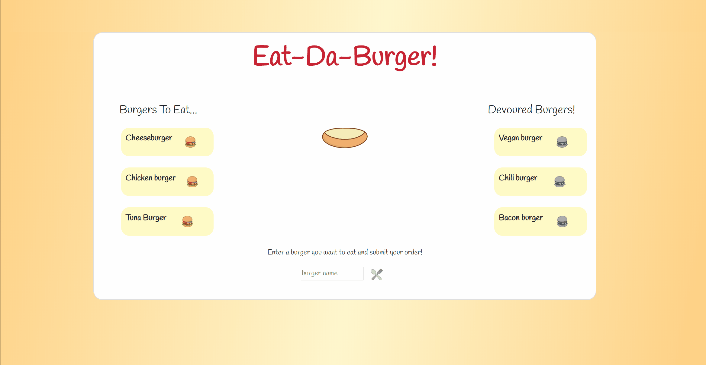
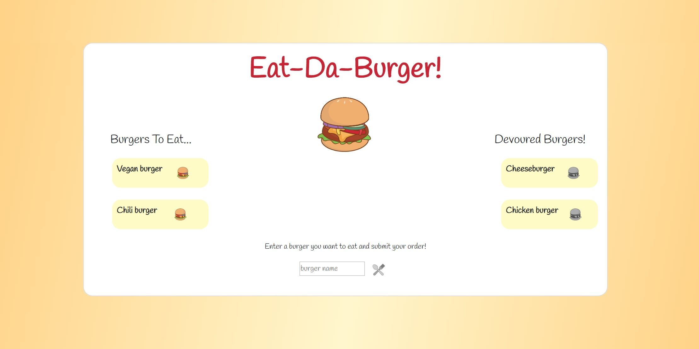

# Eat-Da-Burger   🍔  A Full-Stack Restaurant App Following the MVC Design

Eat-da-Burger is a restaurant app that lets users view, order, and consume their personalized burgers using Node, Express, MySQL, Handlebars, and ORM. Node and MySQL are used to query and route data in the app, and Handlebars are used to generate the HTML. 

Simply enter your buger of choice in the input field and click the utensils to order your burger. Your burger will show up in the 'To be eaten...' column. Upon clicking your beurger icon, your burger will then be devoured and move to the devoured column. Don't worry, y can always click on the eaten burger to eat it again!

# Deployed Application

Try it out!
[Eat-Da-Burger](https://eat-da-burger-log-da-burger.herokuapp.com/)

# User Story

> As a USER, I want to generate a personalized burger so that I can eat it and keep track of the burgers I've consumed.

# Acceptance Criteria

```
GIVEN I want to create a burger
WHEN I input a burgers name
THEN I will be presented with that burger to be devoured

GIVEN I want to devour a burger
WHEN I click on the burger icon besides the burger name
THEN I will see that burger in the "Devoured" list

```

# Technologies Used:
- AJAX
- APIs
- Animate.css
- Bootstrap
- Express
- Handlebars.js
- Heroku
- HTML & CSS
- JavaScript
- jQuery
- MySQL
- Node.js
- NPM:
  - express
  - express-handlebars
  - handlebars-helper-css
  - mysql
- ORM

# Preview

>

>